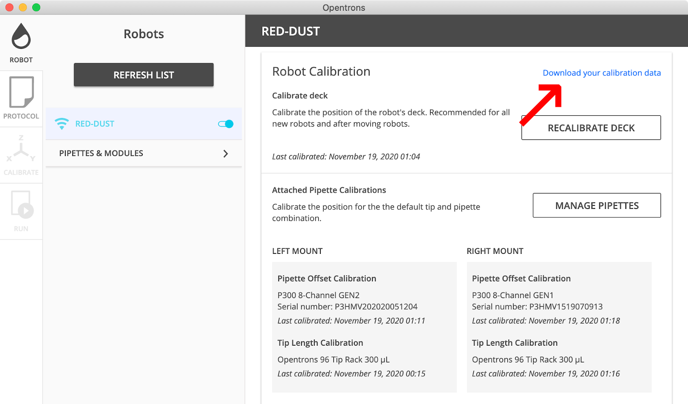

# User Guide

This guide provides a short descriptions of the available functionalities of the ot2-controller and how to use them. Instructions on how to install the software can be found in the [README](../README.md).


## Feature Overview

OT-2 Controller Feature  

Properties:
- **Available Protocols**: Lists all available python protocols installed on the OT-2 device.
- **Camera Picture**: Takes a current picture (*.jpeg) from the deck with the build-in camera.
- **Connection**: Shows some details about the Connection (e.g. IP-Address and  SSH-key fingerprint).
  
Commands:
- **Upload Protocol**: Uploads a given protocol from the host on the device. Therefore, the path to the python file on the host must be given (e.g. `/home/user/my_protocol.py`).
- **Run Protocol**: Runs (or simulates the run) of the given protocol. Therefore, the name of the uploaded file must be given including the `.py` suffix (e.g. `my_protocol.py`).
- **Remove Protocol**: Removes the uploaded file from the device (e.g. `my_protocl.py`).


## Server Start-Up

Ensure all installation steps as described in the [README](../README.md) were completed before you continue.

1. Turn on the OT-2 (obviously).  

2. Establish a network connection to the OT-2:  
This can be achieved via the Opentrons App. Thereby, it doesn't matter if the device is connected via [USB](https://support.opentrons.com/en/articles/2687586-get-started-connect-to-your-ot-2-over-usb) or [Wi-Fi](https://support.opentrons.com/en/articles/2687573-get-started-connect-to-your-ot-2-over-wi-fi-optional).

3. Start the SiLA-Server:  
To start-up the server, the IP-Address of the OT-2 must be given via the `-a` (address) argument. The Address can be looked up in the Opentrons App. It is recommended to [set a static IP-Address](https://support.opentrons.com/en/articles/2934336-manually-adding-a-robot-s-ip-address), otherwise the IP-Address may change on every device restart. 

Now, start the server with the actual IP-Address. Ensure the `sila2lib` library is [installed](https://gitlab.com/SiLA2/sila_python/-/tree/feature/silacodegenerator-0.3#installation) and known to the `pyhton3` interpreter.
```
cd path/to/ot2-controller
# If working with an virtual environment, don't forget to export the environment variables first.
# source path/to/venv/bin/activate
python3 OtController_server.py -a 169.254.92.42
```

The SiLA server should now be available on localhost (`127.0.0.1`) on the default port `50064`.

Generic SiLA 2 clients to inspect and test the available service(s) can be found here:
* [sila-orchestrator](https://github.com/FlorianBauer/sila-orchestrator)
* [SiLA Browser](https://unitelabs.ch/technology/plug-and-play/sila-browser/)

To terminate the server, use **[Ctrl]+[c]** or by typing `stop` into the running terminal window.

**Troubleshooting:**
If no connection to the SiLA server could be established, check if the [SSH Keys](https://support.opentrons.com/en/articles/3203681-setting-up-ssh-access-to-your-ot-2) are properly installed on the OT-2 and the SiLA server host.


## Server Arguments

| Short Flag | Long Flag  | Description             |
|------------|------------|-------------------------|
| `-a` | `--ip-address`   | The IP-address of the OT-2 device to connect to. (mandatory) |
| `-p` | `--port`         | Starts the SiLA server on the given port (default=50064). |
| `-s` | `--server-name`  | Starts the SiLA server with the given name. |
| `-X` | `--encryption`   | The name of the private key and certificate file (without extension). |
| n/a | `--encryption-key`  | The name of the encryption key (*with* extension). Can be used if key and certificate vary or non-standard file extensions are used. |
| n/a | `--encryption-cert` | The name of the encryption certificate (*with* extension). Can be used if key and certificate vary or non-standard file extensions are used. |
| `-v` | `--version`      | Shows the version. |
| `-h` | `--help`         | Shows this help message and exit. |


## Using Protocols

Since the python protocols are executed directly on the robot hardware, the initial calibration 
steps are omitted. Incorrect positioning of the pipettes may be the consequence. To avoid this, it is possible to set the
desired calibration offsets manually within the protocol. Therefore, the offset values must be gathered empirically through testing or can be
extracted from the *.json file exported from the Opentrons App itself (see picture).



The following example shows how the offset values are used in the protocol:

```python
# ...
form opentrons.types import Point
# ...

# The used offsets are defined here. The concret values can be gathered manually or copied from
# an existing file (e.g. from the *.json file exported from the Opentrons App).
OFFSET_RIGHT_MOUNT = Point(x=1.24, y=2.4, z=-0.6) # offset values in mm
OFFSET_LEFT_MOUNT = Point(x=-1.67, y=-0.1, z=2.0)

def run(protocol: protocol_api.ProtocolContext):
    # Load tiprack and set the slot location.
    tiprack1 = protocol.load_labware('opentrons_96_filtertiprack_200ul', 1)

    # Apply the offset.
    tiprack1.set_callibration(OFFSET_RIGHT_MOUNT)  

    # All other labware affected by the corresponding mount shall be adjusted with `set_callibration` as well.
    # ...
```


